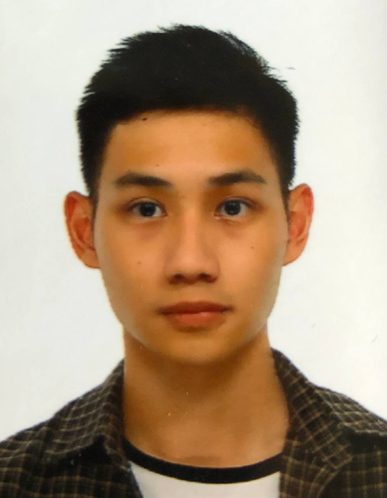
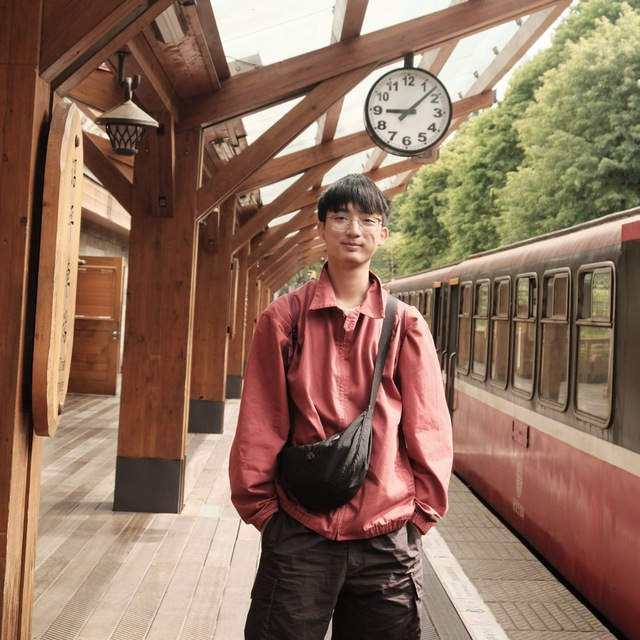
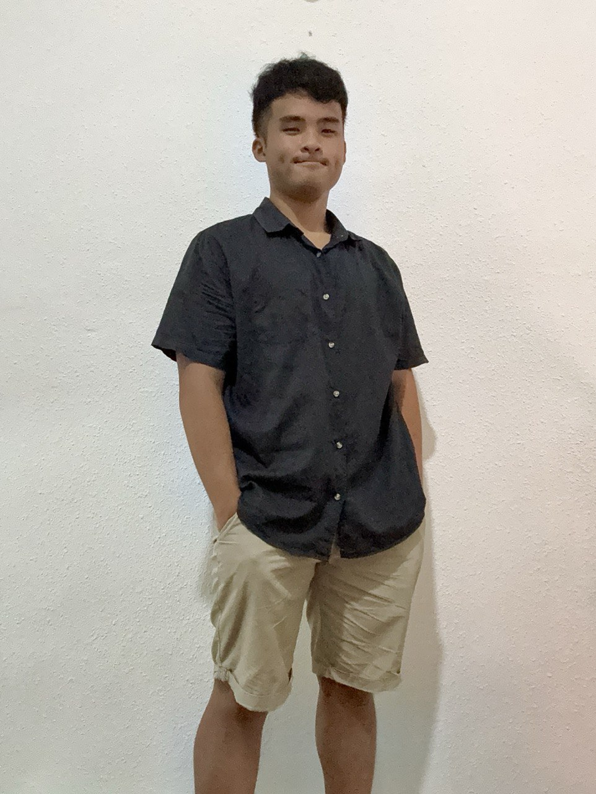
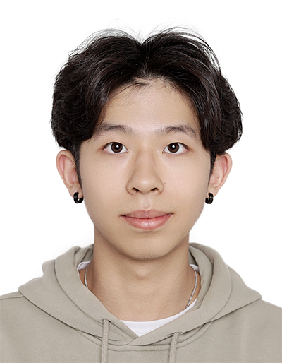
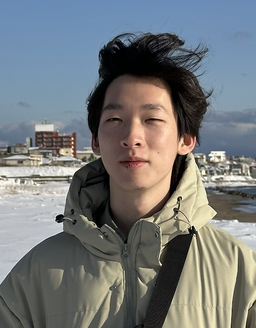

We are a team based in the [School of Computing, National University of Singapore](https://www.comp.nus.edu.sg).

You can reach us at the email `seer[at]comp.nus.edu.sg`

## Project team

### Charles

[[github](https://github.com/charlesl12)]
[[portfolio](team/charlesl12.md)]

* Role: Developer
* Responsibilities: Code quality + Testing

### Nicholas Oh

[[homepage](http://www.comp.nus.edu.sg/~nohjj)]
[[github](https://github.com/nicholasohjj)]
[[portfolio](team/nicholasohjj.md)]

* Role: Team Lead
* Responsibilities: Documentation, deliverables and deadlines

### Guan Zhong

[[github](https://github.com/gztan23)]
[[portfolio](team/gztan23.md)]

* Role: Developer
* Responsibilities: Code quality

### Yan Andong

[[github](http://github.com/andong0909)] [[portfolio](team/andong.md)]

* Role: Developer
* Responsibilities: Data

### Wang Zimeng

[[github](http://github.com/jiangsuwangjing)]
[[portfolio](team/jiangsuwangjing.md)]

* Role: Developer
* Responsibilities: UI
