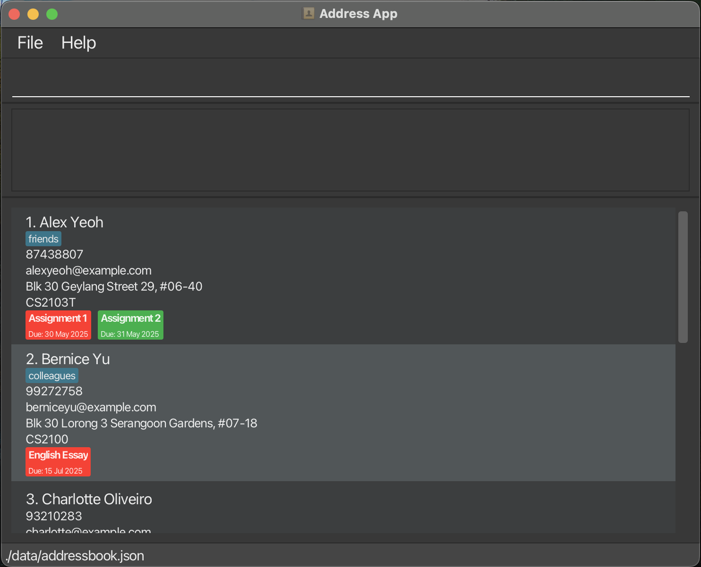
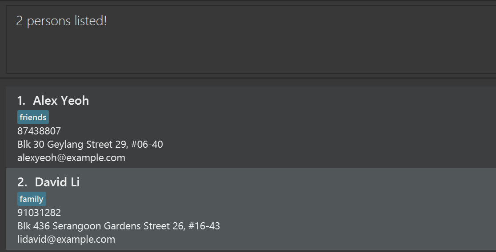

TutorTrack is a **desktop application designed for freelance tutors** to efficiently manage their students, lessons, and assignments. It combines the speed of a **Command Line Interface (CLI)** with the convenience of a **Graphical User Interface (GUI)**, making it ideal for tutors who prefer typing over mouse interactions. If you can type fast, TutorTrack will help you manage your tutoring tasks faster than traditional GUI apps.
### Target Users

TutorTrack is designed for:

- **Freelance tutors** who need to manage multiple students, lessons, and assignments.
- **Tech-savvy individuals** who prefer keyboard commands over mouse interactions.
- **Users who need a simple yet powerful tool** for tracking tutoring-related tasks.

### Assumptions about Users

- Users are familiar with basic CLI commands.
- Users have a basic understanding of file management (e.g., creating folders, moving files).
- Users are comfortable with Java-based applications.

* Table of Contents
{:toc}

--------------------------------------------------------------------------------------------------------------------

## Quick start


1. **Ensure Java 17 or above is installed** on your computer.<br>
   **Mac users:** Follow the installation guide [here](https://se-education.org/guides/tutorials/javaInstallationMac.html).

1. Download the latest `.jar` file from the [releases page](https://github.com/AY2425S2-CS2103T-T13-4/tp/releases).

1. Copy the `.jar` file to the folder you want to use as the _home folder_ for your TutorTrack.

1. Open a command terminal, navigate to the folder containing the `.jar` file using the `cd` command, and run the application with:
    ```bash
    java -jar TutorTrack.jar
    ```
   A GUI similar to the below should appear in a few seconds, preloaded with sample data.<br>
   

1. Type commands in the command box and press `Enter` to execute it. e.g. typing **`help`** and pressing Enter will open the help window.<br>
   - `help`: Opens the help window.
   - `list_students`: Lists all students.
   - `list_lessons n/Jackie` : Lists all lessons under a student or all lessons in the data
   - `add_student n/John Doe p/91234567 e/johndoe@email.com a/311, Clementi Ave 2, #02-25 s/Math`: Adds a new student.
   - `add_lesson n/Johnson Kit d/15-09-2026 t/17:00 s/CS2103T` : Adds a lesson.
   - `add_assignment 2 as/CS2103T tP increment d/19-04-2025` : Adds an assignment to a student in the list.
   - `mark_assignment 2 as/CS2101 CA2` : Marks the assignment under the student as complete
   - `unmark_assignment 3 as/Science CA2` : Marks the assignment under the student as incomplete
   - `delete_student 1`: Deletes the 1st student in the list.
   - `delete_lesson 1`: Deletes the 1st lesson in the list.
   - `clear`: Deletes all students.
   - `find_student Bernice`: Finds student containing Bernice.
   - `exit`: Exits the app.

1. Refer to the [Features](#features) section below for detailed instructions on each command.

--------------------------------------------------------------------------------------------------------------------

## Features

<div markdown="block" class="alert alert-info">

**:information_source: Notes about the command format:**<br>

- **Parameters in `UPPER_CASE`** are to be supplied by the user. Example: In `add_student n/STUDENT_NAME`, `STUDENT_NAME` can be replaced with `John Doe`.

- **Optional fields** are enclosed in square brackets `[]`. Example: `add_student n/NAME p/PHONE [s/SUBJECT]` can be used as `add_student n/John Doe p/91234567 s/Math` or `add_student n/John Doe p/91234567`.

- **Multiple uses** of a field are indicated by `…`.

  Example: `[s/SUBJECT]…` can be used as `s/Math`, `s/Math s/Science`, or omitted entirely.

- **Parameters can be in any order**.

  Example: `n/STUDENT_NAME p/PHONE_NUMBER` is equivalent to `p/PHONE_NUMBER n/STUDENT_NAME`.

- **Extraneous parameters** for commands like `help`, `list_students`, `exit`, and `clear` will be ignored.

  Example: `help 123` is interpreted as `help`.
- If you are using a PDF version of this document, be careful when copying and pasting commands that span multiple lines as space characters surrounding line-breaks may be omitted when copied over to the application.
</div>

### General features

#### Viewing help : `help`

Shows a message explaining how to access the help page.

Format: `help`


#### Clearing all entries : `clear`

Clears all entries from the student list.

Format: `clear`

#### Exiting the program : `exit`

Exits the program.

Format: `exit`

#### Saving the data

TutorTrack data are saved in the hard disk automatically after any command that changes the data. There is no need to save manually.

#### Editing the data file

TutorTrack data is saved automatically as a JSON file `[JAR file location]/data/TutorTrack.json`. Advanced users are welcome to update data directly by editing that data file.

<div markdown="span" class="alert alert-warning">:exclamation: **Caution:**
If your changes to the data file makes its format invalid, TutorTrack will discard all data and start with an empty data file at the next run. Hence, it is recommended to take a backup of the file before editing it.<br>
Furthermore, certain edits can cause the TutorTrack to behave in unexpected ways (e.g., if a value entered is outside of the acceptable range). Therefore, edit the data file only if you are confident that you can update it correctly.
</div>

### Managing students

#### Adding a student: `add_student`

Adds a student to the student list, with their name, phone number, address, email and subjects.
You can add multiple subjects by using the subject prefix  `s/` for each subject.

Format: `add_student n/STUDENT_NAME p/PHONE_NUMBER a/ADDRESS e/EMAIL s/SUBJECT ​`

<!--
<div markdown="span" class="alert alert-primary">:bulb: **Tip:**
A student can have any number of subjects (including 0)
</div>
-->

Examples:
* `add_student n/John Doe p/98765432 e/johndoe@email.com a/311, Clementi Ave 2, #02-25 s/Math`
* `add_student n/Mary Jane p/12345678 e/maryjane@email.com a/Blk 47 Tampines Street 20, #17-35 s/Math s/Science`

#### Editing a student: `edit_student`
You can edit the details of a student in the student list.
You can edit individual details or edit multiple of them together.
Editing subject is not available yet but you will have it in future versions.

Format: `edit_student INDEX [n/STUDENT_NAME] [p/PHONE] [e/EMAIL] [a/ADDRESS]`

Examples:
* `edit_student 1 p/91234567`
* `edit_student 2 n/Betsy Crower e/betsy@gmail.com a/Blk 123, Clementi Ave 2, #08-25`

#### Deleting a student : `delete_student`

Deletes the specified student from the student list.

Format: `delete_student INDEX`

* Deletes the student at the specified `INDEX`.
* The index refers to the index number shown in the displayed student list.
* The index **must be a positive integer** 1, 2, 3, …​

Examples:
* `list_students` followed by `delete_student 2` deletes the 2nd student in the student list.

#### Listing all students : `list_students`

Switch to a view that shows all students in the student list.

Format: `list_students`

### Managing lessons

#### Adding a lesson: `add_lesson`

Adds a lesson to the lesson list.

Format: `add_lesson n/NAME s/SUBJECT d/DATE t/TIME​`

Example:
* `add_lesson n/Alice Chan d/17-09-2025 t/15:00 s/Math`

#### Editing a lesson: `edit_lesson`
You can edit the details of a lesson in the lesson list.
You can edit individual details or edit multiple of them together.

Format: `edit_lesson INDEX [n/STUDENT_NAME] [d/DATE] [t/TIME] [s/SUBJECT]`

Examples:
* `edit_lesson 1 d/16-02-2026`
* `edit_lesson 2 n/Jone King t/16:00 d/18-9-2025 s/Math`

#### Deleting a lesson: `delete_lesson`

Deletes the specified lesson from the lesson list.

Format: `delete_lesson INDEX`

* Deletes the lesson at the specified `INDEX`.
* The index refers to the index number shown in the displayed lesson list.
* The index **must be a positive integer** 1, 2, 3, …​

Examples:
* `list_lessons` followed by `delete_lesson 2` deletes the 2nd lesson in the lesson list.
* `list_lessons n/John Lee` followed by `delete_lesson 1` deletes the 1st lesson in the lesson list.

#### Listing lessons : `list_lessons`

Shows a list of all lessons under a student in the lesson list. If no student is specified, shows all lessons in the list.

Format: `list_lessons n/STUDENT_NAME`

Example:
* `list_lessons n/John Lee`
* `list_lessons`

### Managing assignments

#### Adding an assignment: `add_assignment`

Adds an assignment to a student in the student list

Format: `add_assignment STUDENT_INDEX as/ASSIGNMENT d/DATE`

Example:
* `add_assignment 2 as/Science 101 d/27-09-2026`

#### Deleting an assignment: `delete_assignment`

Deletes the assignment identified by the index number of the student and the assignment name. The assignment will be removed from the student's list of assignments.

**Format:**

`delete_assignment INDEX as/ASSIGNMENT_NAME`

- `INDEX` must be a positive integer corresponding to the assignment in the displayed list.
- `ASSIGNMENT_NAME` is the name of the assignment to delete.

**Example:**
- `delete_assignment 1 as/Assignment 1` deletes the assignment named `Assignment 1` for the first student in the list.

#### Marking an assignment: `mark_assignment`

Marks the assignment identified by the index number of the student and the assignment name. Marking an assignment will change its status to "completed" (e.g., displayed in green).

Format: `mark_assignment INDEX as/ASSIGNMENT_NAME​`
- `INDEX` must be a positive integer corresponding to the assignment in the displayed list.
- `ASSIGNMENT_NAME` is the name of the assignment to mark.

**Example:**

- `mark_assignment 1 as/Assignment 1` marks the first assignment in the list as completed.

#### Unmarking an Assignment: `unmark_assignment`

Unmarks the assignment identified by the index number of the student and the assignment name. Unmarking an assignment will change its status to "incomplete" (e.g., displayed in red).

**Format:**

`unmark_assignment INDEX as/ASSIGNMENT_NAME`

- `INDEX` must be a positive integer corresponding to the assignment in the displayed list.
- `ASSIGNMENT_NAME` is the name of the assignment to unmark.

**Example:**
- `unmark_assignment 1 as/Assignment 1` unmarks the first assignment in the list, setting it to incomplete.

<!--
### Editing a student : `edit_student`

Edits an existing student in the student list.

Format: `edit_student INDEX [n/STUDENT_NAME] [p/PHONE] [e/EMAIL] [s/SUBJECT]…​`

* Edits the student at the specified `INDEX`. The index refers to the index number shown in the displayed student list. The index **must be a positive integer** 1, 2, 3, …​

* At least one of the optional fields must be provided.

* Existing values will be updated to the input values.

* When editing subjects, the existing subjects of the student will be removed i.e adding of subjects is not cumulative.

* You can remove all the student’s subjects by typing `s/` without

    specifying any subjects after it.

Examples:

*  `edit_student 1 p/91234567 e/johndoe@example.com` Edits the phone number and email address of the 1st student to be `91234567` and `johndoe@example.com` respectively.

*  `edit_student 2 n/Betsy Crower s/` Edits the name of the 2nd student to be `Betsy Crower` and clears all existing subjects.

### Locating students by name: `find_student`

Finds students whose names contain any of the given keywords.

Format: `find_student KEYWORD [MORE_KEYWORDS]`

* The search is case-insensitive. e.g `hans` will match `Hans`

* The order of the keywords does not matter. e.g. `Hans Bo` will match `Bo Hans`

* Only the name is searched.

* Only full words will be matched e.g. `Han` will not match `Hans`

* Students matching at least one keyword will be returned (i.e. `OR` search).

  e.g. `Hans Bo` will return `Hans Gruber`, `Bo Yang`

Examples:

* `find_student John` returns `john` and `John Doe`

* `find_student alex david` returns `Alex Yeoh`, `David Li`<br>

  
-->

### Clearing all entries : `clear`

Clears all entries from the student list.

Format: `clear`

### Exiting the program : `exit`

Exits the program.

Format: `exit`

### Saving the data

TutorTrack data are saved in the hard disk automatically after any command that changes the data. There is no need to save manually.

### Editing the data file

TutorTrack data is saved automatically as a JSON file `[JAR file location]/data/TutorTrack.json`. Advanced users are welcome to update data directly by editing that data file.

<div markdown="span" class="alert alert-warning">:exclamation: **Caution:**
If your changes to the data file makes its format invalid, TutorTrack will discard all data and start with an empty data file at the next run. Hence, it is recommended to take a backup of the file before editing it.<br>
Furthermore, certain edits can cause the TutorTrack to behave in unexpected ways (e.g., if a value entered is outside of the acceptable range). Therefore, edit the data file only if you are confident that you can update it correctly.
</div>

### Archiving data files `[coming in v2.0]`

_Details coming soon ..._

--------------------------------------------------------------------------------------------------------------------

## FAQ

**Q:** How do I transfer my data to another computer?

**A:**
Install the app on the new computer and replace the empty data file with the one from your previous TutorTrack folder.
--------------------------------------------------------------------------------------------------------------------

## Known issues

1. **Multiple Screens Issue:** If you move the app to a secondary screen and later switch to a single screen, the GUI may open off-screen. To fix, delete the `preferences.json` file before running the app again.
2. **Help Window Issue:** Minimizing the Help Window and running `help` again may not open a new window. Restore the minimized window manually.

--------------------------------------------------------------------------------------------------------------------

## Command summary

### 👤 Student Management

| Action             | Format, Examples |
|--------------------|------------------|
| **Add Student**    | `add_student n/NAME p/PHONE e/EMAIL a/ADDRESS s/SUBJECT`<br>e.g., `add_student n/John Doe p/91234567 e/john@example.com a/123 Street s/Math` |
| **Edit Student**   | `edit_student INDEX [n/NAME] [p/PHONE] [e/EMAIL] [a/ADDRESS]`<br>e.g., `edit_student 1 p/98765432` |
| **Delete Student** | `delete_student INDEX`<br>e.g., `delete_student 3` |
| **Find Student** | `find_student KEYWORD [MORE_KEYWORDS]` e.g., find_student James Jake
| **List Students**  | `list_students` |


### 📚 Lesson Management

| Action             | Format, Examples |
|--------------------|------------------|
| **Add Lesson**     | `add_lesson n/STUDENT_NAME d/DATE t/TIME s/SUBJECT`<br>e.g., `add_lesson n/Jack d/16-10-2025 t/15:00 s/CS2103T` |
| **Edit Lesson**    | `edit_lesson INDEX [n/STUDENT_NAME] [d/DATE] [t/TIME] [s/SUBJECT]`<br>e.g., `edit_lesson 1 d/20-10-2025 t/14:00` |
| **Delete Lesson**  | `delete_lesson INDEX`<br>e.g., `delete_lesson 1` |
| **List Lessons**   | `list_lessons [n/STUDENT_NAME]`<br>e.g., `list_lessons`, `list_lessons n/Sally Mood` |


### 📝 Assignment Management

| Action                | Format, Examples |
|------------------------|------------------|
| **Add Assignment**     | `add_assignment STUDENT_INDEX as/ASSIGNMENT d/DATE`<br>e.g., `add_assignment 1 as/Math Homework d/23-07-2025` |
| **Delete Assignment**  | `delete_assignment STUDENT_INDEX as/ASSIGNMENT_NAME`<br>e.g., `delete_assignment 1 as/Assignment 1` |
| **Mark Assignment**    | `mark_assignment STUDENT_INDEX as/ASSIGNMENT_NAME`<br>e.g., `mark_assignment 1 as/Assignment 1` |
| **Unmark Assignment**  | `unmark_assignment STUDENT_INDEX as/ASSIGNMENT_NAME`<br>e.g., `unmark_assignment 1 as/Assignment 1` |


### 🧹 General Utility

| Action         | Format, Examples |
|----------------|------------------|
| **Clear**      | `clear` |
| **Help**       | `help` |
| **Exit**       | `exit` |                                                                                                                                                                  |

<!--
**Edit** | `edit_student INDEX [n/STUDENT_NAME] [p/PHONE] [e/EMAIL] [s/SUBJECT]…​`<br> e.g.,`edit_student 2 n/James Lee e/jameslee@example.com`
**Find** | `find_student KEYWORD [MORE_KEYWORDS]`<br> e.g., `find_student James Jake`
-->
